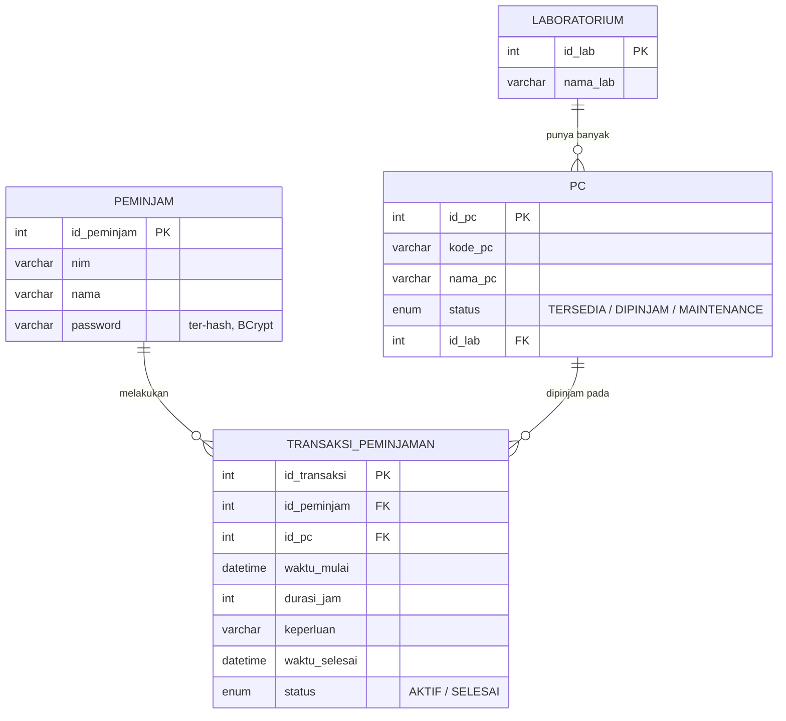

# PC Booking — Sistem Peminjaman PC Laboratorium

Aplikasi web untuk mengelola peminjaman PC di laboratorium kampus. Mahasiswa bisa daftar, login, melihat PC yang tersedia per lab, melakukan booking, dan melihat riwayat peminjamannya sendiri. Dibangun dengan **Spring Boot** (server-side rendering pakai **Thymeleaf**), database **MySQL/MariaDB**.

## Daftar Isi

- [Fitur](#fitur)
- [Tech Stack](#tech-stack)
- [Arsitektur](#arsitektur)
- [Skema Database](#skema-database)
- [Struktur Folder](#struktur-folder)
- [Alur Aplikasi](#alur-aplikasi)
- [Instalasi & Menjalankan di Windows](#instalasi--menjalankan-di-windows)
- [Instalasi & Menjalankan di Linux](#instalasi--menjalankan-di-linux)
- [Build ke File JAR](#build-ke-file-jar)
- [Konfigurasi Tambahan](#konfigurasi-tambahan)
- [Troubleshooting](#troubleshooting)
- [Keamanan](#keamanan)

## Fitur

- Registrasi & login mahasiswa (peminjam) berbasis NIM, password tersimpan ter-hash (BCrypt)
- Dashboard ringkasan: total PC, jumlah PC tersedia/dipinjam/maintenance, total transaksi
- Daftar seluruh PC beserta laboratorium dan statusnya
- Booking PC yang berstatus `TERSEDIA` (isi durasi jam & keperluan)
- Riwayat peminjaman per mahasiswa, dengan tombol "Selesai" untuk mengakhiri sesi peminjaman (PC otomatis kembali `TERSEDIA`)
- Logout (invalidate session)
- Skema database & data referensi (lab + PC) ter-*seed* otomatis saat aplikasi pertama kali start — tidak perlu import SQL manual

## Tech Stack

| Komponen | Detail |
|---|---|
| Bahasa | Java 17 |
| Framework | Spring Boot 3.5.15 |
| Web | Spring Web MVC + Thymeleaf (server-side rendering) |
| Data | Spring Data JPA + Hibernate |
| Database | MySQL / MariaDB |
| Keamanan | BCrypt (`spring-security-crypto`) untuk hashing password |
| Build tool | Maven (sudah disertakan Maven Wrapper: `mvnw` / `mvnw.cmd`) |

## Arsitektur

Layered architecture standar Spring Boot: Controller → Service → Repository → Database, dengan Thymeleaf sebagai view layer.

```
Browser (HTML Thymeleaf + CSS + JS)
        │  request HTTP (GET/POST form)
        ▼
┌─────────────────────────────────────────────┐
│ Controller Layer                             │
│ LoginController, DashboardController,        │
│ PcController, BookingController,             │
│ HistoryController                            │
└─────────────────────────────────────────────┘
        │
        ▼
┌─────────────────────────────────────────────┐
│ Service Layer (business logic)               │
│ PeminjamService (+ BCrypt hashing),          │
│ PCService, TransaksiPeminjamanService,       │
│ LaboratoriumService                          │
└─────────────────────────────────────────────┘
        │
        ▼
┌─────────────────────────────────────────────┐
│ Repository Layer (Spring Data JPA)           │
└─────────────────────────────────────────────┘
        │
        ▼
   Database MySQL/MariaDB (pc_booking)
   — skema & data referensi otomatis dibuat saat start
```

Sesi login disimpan lewat `HttpSession` (atribut `nim`).

## Skema Database



Data referensi lab & PC di-*seed* otomatis lewat `src/main/resources/data.sql` saat aplikasi start. Data akun (`peminjam`) dan transaksi dibuat lewat pemakaian aplikasi (`/register` dan `/booking`).

## Struktur Folder

```
pcbooking/
├── mvnw, mvnw.cmd                    # Maven Wrapper (Linux/Mac & Windows)
├── pom.xml                           # dependency & konfigurasi build
├── src/main/java/com/booking/flightbooking/
│   ├── PCbookingApplication.java     # entry point (main class)
│   ├── config/                       # konfigurasi bean (PasswordEncoder)
│   ├── controller/                   # menerima HTTP request
│   ├── service/                      # logika bisnis
│   ├── repository/                   # interface Spring Data JPA
│   └── model/                        # entity JPA + enum status
├── src/main/resources/
│   ├── application.properties        # konfigurasi koneksi database
│   ├── data.sql                      # seed data referensi (lab & PC)
│   ├── templates/                    # halaman Thymeleaf (.html)
│   └── static/css & static/javascript
└── src/test/                         # unit test
```

## Alur Aplikasi

1. `GET/POST /register` — mahasiswa daftar (NIM, nama, password — otomatis di-hash)
2. `GET/POST /login` — kalau NIM + password cocok, NIM disimpan di session, redirect ke `/dashboard`
3. `GET /dashboard` — ringkasan jumlah PC per status & total transaksi
4. `GET /pc` — daftar semua PC beserta lab & status
5. `GET /booking` — daftar PC berstatus `TERSEDIA`; `POST /booking` — submit booking → transaksi baru `AKTIF`, PC jadi `DIPINJAM`
6. `GET /history` — riwayat booking milik NIM yang sedang login; `POST /history/selesai/{id}` — tandai transaksi `SELESAI`, PC kembali `TERSEDIA`
7. `GET /logout` — hapus session

## Instalasi & Menjalankan di Windows

### Prasyarat
- **JDK 17** — cek dengan `java -version` di Command Prompt
- **MySQL/MariaDB** sudah terpasang dan service-nya berjalan (misal lewat XAMPP/Laragon)
- Maven **tidak perlu diinstal manual**, sudah ada Maven Wrapper (`mvnw.cmd`)

> **Catatan:** default `username=root` tanpa password di bawah ini biasanya jalan mulus di Windows (XAMPP/Laragon/MySQL Installer pakai autentikasi password biasa untuk root). Ini beda dengan Linux, di mana banyak distro mengunci `root` dengan autentikasi `unix_socket` — lihat bagian [Instalasi & Menjalankan di Linux](#instalasi--menjalankan-di-linux) kalau kamu dual-boot atau pindah ke Linux.

### Langkah-langkah
1. Ekstrak project, masuk ke folder `pcbooking`.
2. Pastikan MySQL/MariaDB sudah menyala (misal via XAMPP Control Panel).
3. Sesuaikan `src\main\resources\application.properties` kalau username/password MySQL kamu beda dari default (`root` tanpa password). Database `pc_booking` dan tabel-tabelnya akan **dibuat otomatis** saat aplikasi start.
4. Buka Command Prompt di folder `pcbooking`, jalankan:
   ```cmd
   mvnw.cmd spring-boot:run
   ```
5. Tunggu sampai log menunjukkan `Started PCbookingApplication`, lalu buka browser ke:
   ```
   http://localhost:8080
   ```
   (otomatis redirect ke halaman login)
6. Klik **Daftar** untuk buat akun baru, atau langsung login kalau sudah punya akun.

## Instalasi & Menjalankan di Linux

### Prasyarat
- **JDK 17**
- **MySQL/MariaDB** sudah terpasang dan service-nya berjalan
- Maven **tidak perlu diinstal manual**, pakai Maven Wrapper (`./mvnw`)

### Langkah-langkah (contoh Ubuntu/Debian & Fedora, sesuaikan package manager distro kamu)

1. Instal JDK 17 (kalau belum ada):
   ```bash
   sudo apt install openjdk-17-jdk        # Ubuntu/Debian
   sudo dnf install java-17-openjdk       # Fedora
   ```
   Cek: `java -version`

2. Instal & jalankan MariaDB (atau MySQL):
   ```bash
   sudo apt install mariadb-server         # Ubuntu/Debian
   sudo dnf install mariadb-server         # Fedora

   sudo systemctl start mariadb
   sudo systemctl enable mariadb
   ```

3. **Buat user MySQL khusus untuk aplikasi ini (jangan pakai `root`).**

   Di banyak distro Linux (Ubuntu, Fedora, dll), instalasi MariaDB/MySQL default mengunci user `root` dengan autentikasi `unix_socket` — artinya `root` cuma bisa login lewat `sudo`, **bukan** lewat username/password biasa seperti yang dipakai aplikasi Spring Boot untuk connect via JDBC. Kalau tetap pakai `root` di `application.properties`, aplikasi akan gagal start dengan `Access denied for user 'root'@'localhost'` walaupun passwordnya sudah benar.

   Solusinya, buat user baru khusus untuk aplikasi ini:
   ```bash
   sudo mariadb
   ```
   Di dalam prompt MariaDB:
   ```sql
   CREATE USER 'pcbooking'@'localhost' IDENTIFIED BY 'pcbooking123';
   CREATE DATABASE IF NOT EXISTS pc_booking;
   GRANT ALL PRIVILEGES ON pc_booking.* TO 'pcbooking'@'localhost';
   FLUSH PRIVILEGES;
   EXIT;
   ```
   (Ganti `pcbooking123` sesuka kamu, asal nanti disamakan dengan `application.properties`.)

4. Sesuaikan `src/main/resources/application.properties`:
   ```properties
   spring.datasource.url=jdbc:mysql://localhost:3306/pc_booking?createDatabaseIfNotExist=true&useSSL=false&allowPublicKeyRetrieval=true&serverTimezone=Asia/Jakarta
   spring.datasource.username=pcbooking
   spring.datasource.password=pcbooking123
   ```
   Tabel & data referensi dibuat **otomatis** saat aplikasi start, tidak perlu import SQL manual.

5. Jalankan dari folder `pcbooking`:
   ```bash
   ./mvnw spring-boot:run
   ```
   (kalau muncul `Permission denied`, jalankan `chmod +x mvnw` dulu)

6. Buka browser:
   ```
   http://localhost:8080
   ```

> **Catatan:** kalau kamu juga pernah menjalankan MySQL/MariaDB lewat Docker (misal untuk keperluan lain/praktikum) dan container-nya masih menyala, itu bisa "menyerobot" port 3306 duluan dan bikin aplikasi ini connect ke database yang salah. Pastikan cuma satu MySQL/MariaDB yang aktif di port 3306 saat menjalankan aplikasi ini (`docker ps` untuk cek, `docker stop <nama_container>` untuk mematikan kalau perlu).

## Build ke File JAR

```bash
# Linux
./mvnw clean package -DskipTests
java -jar target/pcbooking-0.0.1-SNAPSHOT.jar
```

```cmd
:: Windows
mvnw.cmd clean package -DskipTests
java -jar target\pcbooking-0.0.1-SNAPSHOT.jar
```

## Konfigurasi Tambahan

Semua ada di `src/main/resources/application.properties`:

```properties
spring.datasource.url=jdbc:mysql://localhost:3306/pc_booking?createDatabaseIfNotExist=true&useSSL=false&allowPublicKeyRetrieval=true&serverTimezone=Asia/Jakarta
spring.datasource.username=pcbooking
spring.datasource.password=pcbooking123
```

- Ganti `username` / `password` sesuai kredensial MySQL/MariaDB kamu. Di Windows, `root` tanpa password biasanya cukup. Di Linux, disarankan pakai user khusus (lihat langkah instalasi Linux di atas) karena `root` sering dikunci ke autentikasi `unix_socket`.
- Ganti `localhost:3306` kalau MySQL jalan di host/port lain.
- Tambahkan `server.port=8081` (atau port lain) di file yang sama kalau port 8080 sudah dipakai aplikasi lain.

## Troubleshooting

| Gejala | Kemungkinan Penyebab |
|---|---|
| `Communications link failure` / `Connection refused` | MySQL/MariaDB belum jalan, atau salah port |
| `Access denied for user 'root'@'localhost'` (Linux) | `root` dikunci autentikasi `unix_socket` di banyak distro Linux — buat user khusus, lihat langkah 3 di [Instalasi & Menjalankan di Linux](#instalasi--menjalankan-di-linux) |
| `Access denied for user 'root'@'172.18.0.1'` atau IP mirip `172.x.x.x` | Ada MySQL/MariaDB lain yang jalan lewat **Docker** dan menyerobot port 3306 duluan — cek `docker ps`, matikan container yang tidak dipakai dengan `docker stop <nama_container>` |
| `Access denied` dengan username/password lain (bukan root) | Username/password di `application.properties` tidak cocok dengan user MySQL/MariaDB kamu |
| Port 8080 sudah dipakai aplikasi lain | Tambahkan `server.port=8081` di `application.properties` |
| `mvnw: Permission denied` (Linux) | Jalankan `chmod +x mvnw` |
| Login gagal padahal yakin password benar | Pastikan akun didaftarkan lewat `/register` di versi aplikasi ini (password lama dari dump SQL versi sebelumnya, kalau ada, tersimpan plain text dan tidak akan cocok dengan pengecekan hash yang baru) |

## Keamanan

- Password disimpan ter-hash pakai **BCrypt** (`spring-security-crypto`), tidak plain text.
- Sesi login masih ditangani manual lewat `HttpSession`, belum pakai filter/proteksi endpoint dari Spring Security penuh. Kalau mau dikembangkan lebih lanjut, pertimbangkan menambah guard session di tiap controller dan validasi input pada form.

